# What is WebRTC?

WebRTC (Web Real-Time Communication) is an open-source technology that enables real-time communication directly between web browsers. It allows browsers to establish peer-to-peer connections for audio, video, and data sharing without the need for additional plugins, software or a third party.

* Peer-to-peer
* Any arbitraty data ( text, images etc. )
* Cross Platform Compatibility
* Open Source

<div class="flex items-center space-x-6 mt-8 justify-center">
   
   
   
</div>
---

# TL;DR

There are 2 kinds of data that needs to be exchanged between the peers. 

<ul>
  <li> Media ( the session itself ) - handled by ICE </li>
  <li v-click-hide> Metadata ( data about the session ) - handled by SDP </li>
</ul>


---

# WebRTC Protocols

WebRTC is built on top of some fundamental underlying protocols

* Interactive Connectivity Establishment ( aka. ICE )
  * NAT
  * STUN
  * TURN
* Session Description Prtocol ( aka. SDP )

---

# What do I need for two peers to start talking?


---

# There's a NAT 🥲


NAT (Network Address Translation) is a technique used to allow multiple devices within a private network to share a single public IP address.

Helps with **address conservation**, **security** & **IPv4 to IPv6 transition**

NAT provides a lot of benefits but introduces challenges for P2P communication

---

# NAT Table


---
layout: center
class: text-center
---

# But there is a problem...

A peer cannot figure out its IP by itself.


---

# STUN (Session Traversal Utilities for NAT)


A network protocol used to discover and obtain **public IP addresses** and **ports** of devices located behind a NAT or firewall.

It also helps determine any router restrictions that may prevent two peers from establishing a direct connection.

--- 
layout: two-cols
---

# STUN Server

* Alice establishes connection with a preconfigured STUN server and sends a request to obtain their public IP and port
* STUN server responds with the public IP and port of Alice
* Bob performs the same steps and obtains their public IP and port
* Alice and Bob can now talk to each other

In addition to the public IP and port, STUN server also provides information about the type of NAT and firewall that the peer is behind.

::right::

```mermaid {mirrorActors: true}
sequenceDiagram
  actor Alice
  participant STUN Server
  actor Bob

  Alice->>STUN Server: Establish Connection
  Alice->>STUN Server: Hey, what's my IP address?
  STUN Server->>Alice: Send STUN response
  Note over Alice, STUN Server: IP Address: 203.0.113.100 Port: 5000

  Bob->>STUN Server: Establish Connection
  Bob->>STUN Server: Hey, what's my IP address?
  STUN Server->>Bob: Send STUN response
  Note over Bob, STUN Server: IP Address: 198.51.100.42 Port: 6000

  Alice->>Bob: Hey 👋 Bob
  Bob->>Alice: Hey 👋 Alice
```


---

# NAT Restrictions

A NAT can employ several restrictions which can prevent two peers from establishing a direct connection. Eg: Symmetric NAT, Restricted NAT, Port Restricted NAT versus a Full Cone NAT.


---

# TURN (Traversal Using Relays around NAT)

TURN Servers allow clients to bypass NAT restrictions by relaying all the information through them. This method comes with some overhead so it’s only used if there are no other alternatives.


---

# ICE (Interactive Connectivity Establishment)

ICE is a framework that allows your web browser to connect with other peers.

A direct connection between two peers may not always be possible due to 

* Unavailability of a public IP
* NAT Restrictions
* Firewalls

ICE uses STUN & TURN servers to make this possible
---

# ICE Candidates 

An ICE candidate represents a pathway a peer can take to communicate with the other peer. 

Both peers generate a set of ICE candidates during the negotiation process and choose one that both agree upon.

```js {1-2|4-5|7-9|10-12|13-15}
candidate: 3117780270 1 tcp 1518280447 192.168.1.47 9 typ host tcptype active generation 
0 ufrag 1NUw network-id 1 network-cost 10

candidate: 2141339401 1 udp 1686052607 122.171.17.151 17895 typ srflx raddr 192.168.1.47
rport 60988 generation 0 ufrag 1NUw network-id 2 network-cost 17

candidate: 2141339401 1 udp 1686052607 122.171.17.151 27513 typ srflx raddr 192.168.1.47
rport 60988 generation 0 ufrag 1NUw network-id 3 network-cost 17

candidate: 359599086 1 udp 41885951 216.39.253.11 47194 typ relay raddr 122.171.17.151
rport 27513 generation 0 ufrag 1NUw network-id 1 network-cost 25

candidate: 359599086 1 udp 41886207 216.39.253.11 47973 typ relay raddr 122.171.17.151
rport 17895 generation 0 ufrag 1NUw network-id 1 network-cost 25
```

---
layout: center
class: text-center
---

# Demo

[ICE Candidate Generation](https://webrtc.github.io/samples/src/content/peerconnection/trickle-ice/)

---

# TL;DR

There are 2 kinds of data that needs to be exchanged between the peers. 

<ul>
  <li v-click-hide> Media ( the session itself ) - handled by ICE </li>
  <li> Metadata ( data about the session ) - handled by SDP </li>
</ul>


---

# SDP (Session Description Protocol)

A standard for describing the multimedia content of the connection such as resolution, formats, codecs, encryption, etc. so that both peers can understand each other once the data is transferring.

```less
v=0
o=- 5828042020818186639 2 IN IP4 127.0.0.1 // Origin: Session originator and version
s=- // Session Name
t=0 0 // Timing: Start time and end time
a=group:BUNDLE audio video // Grouping of media streams
m=audio 5000 RTP/AVP 0 // Audio media stream details
c=IN IP4 192.168.0.100 // Connection information
a=rtpmap:0 PCMU/8000 // Audio codec mapping
a=sendrecv // Desired mode: sendrecv (both send and receive)
m=video 6000 RTP/AVP 96 // Video media stream details
c=IN IP4 192.168.0.100 // Connection information
a=rtpmap:96 H264/90000 // Video codec mapping
a=sendrecv // Desired mode: sendrecv (both send and receive)
```

[Learn More](https://webrtchacks.com/sdp-anatomy/)

---

# SDP vs ICE

<br/>

|                     | SDP (Session Description Protocol)                      | ICE (Interactive Connectivity Establishment)                         |
| ------------------- | -------------------------------------------------------- | ------------------------------------------------------------------- |
| Purpose             | Describes and negotiates session parameters               | Establishes network connectivity and traversal for direct communication |
| Usage               | Used during the initial handshake process                 | Used to determine the best network path for communication            |
| Information         | Includes details about media streams, codecs, and more    | Gathers transport addresses and performs network connectivity checks |
